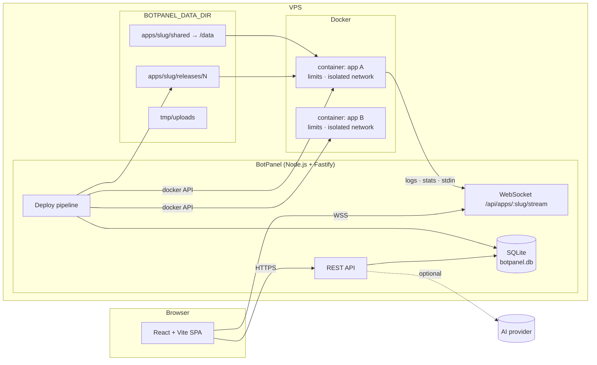

# BotPanel

A private, self-hosted control panel for running **many bots and small applications on a single VPS**.
You upload a ZIP, BotPanel detects the runtime, installs the dependencies, starts the app inside an
isolated Docker container and gives you logs, a console, a file manager, backups, rollbacks and
optional AI log analysis — all from one web dashboard.

It is designed for **one administrator hosting their own projects** (Discord bots, workers, small
APIs). It is *not* a multi-tenant hosting business: there are no plans, no customers, no per-user
permissions.


> **Language note:** the documentation in this repository is in English. The web interface and the
> code comments are currently in Brazilian Portuguese — the panel ships a single locale. See
> [docs/architecture.md](docs/architecture.md#i18n).

---

## Table of contents

- [Features](#features)
- [Architecture](#architecture)
- [Requirements](#requirements)
- [Installation](#installation)
- [Configuration](#configuration)
- [First login](#first-login)
- [Creating an application](#creating-an-application)
- [Application lifecycle](#application-lifecycle)
- [Backups](#backups)
- [AI log analysis](#ai-log-analysis)
- [Security](#security)
- [Production deployment](#production-deployment)
- [Updating BotPanel](#updating-botpanel)
- [Troubleshooting](#troubleshooting)
- [Development](#development)
- [Testing](#testing)
- [Project structure](#project-structure)
- [Documentation](#documentation)
- [Credits](#credits)
- [License](#license)

---

## Features

### Applications

- **Deploy from a ZIP** — upload the project (or drag-and-drop), the panel extracts it, strips a
  single top-level folder when present and publishes a new release.
- **Automatic runtime detection** — Node.js (`package.json`, entry `index.js`/`server.js`/…),
  Python (`requirements.txt`, entry `main.py`/`bot.py`/…), or an explicit "custom command" mode.
- **Configurable execution** — entry file, dependency file, install command, start command, and an
  escape hatch for anything the presets do not cover.
- **Dependency installation on the server** — `npm install` (with `npm ci` when a lockfile exists)
  or `pip install --requirement requirements.txt`, always executed inside a disposable container
  *inside the release being deployed*, so the host stays clean.
- **Isolated containers** — one container and one Docker network per application.
- **Resource limits per application** — RAM, CPU (vCPU), and a process (PID) limit.
- **Persistent `/data`** — mounted from the host, never touched by deploys, rollbacks or updates.
- **Environment variables** — per application, with optional secret flag (masked in the UI).
- **Published ports** — optional `hostPort:containerPort` mappings.
- **Application icon** — point it at any image URL (for example the Discord avatar of your bot);
  falls back to the initials of the name.
- **Start / stop / restart**, plus two independent automation switches:
  - **Start with the system** — the application comes back when the VPS (or the panel) restarts.
  - **Restart automatically** — the process is brought back up after crashing.
  - Pressing **Stop** always wins: a deliberately stopped application is never resurrected.

### Observability and control

- **Real-time logs** over WebSocket (`stdout`/`stderr`), with filtering, auto-scroll, download and a
  clear-view button. Every line is stamped with the run it belongs to, so restarting the container
  clears the screen instead of mixing old and new executions.
- **Interactive console** — send text to the process `stdin`, with `↑`/`↓` history.
- **Live metrics** — CPU, memory, PIDs, uptime and status, streamed to the browser.
- **File manager** — browse both the *code* (active release) and the *data* (persistent) roots,
  open and edit text files, save, upload, download, create folders, rename and delete.
- **Backups** — create a ZIP of the code of the active release and, optionally, of `/data`; then
  download or delete it. Available per application and on a global page.
- **Code updates** — upload a new ZIP for an existing application; the update replaces the code but
  never the persistent data. If dependency installation fails, the previous version keeps running.
- **Immutable releases + rollback** — every deploy creates `releases/N`; you can reactivate any
  previous one. A retention policy controls how many are kept.
- **Dashboard** — totals, online/stopped/unknown counters, CPU and memory usage, host capacity and a
  card per application with live metrics and management buttons.
- **System page** — Docker status/version, host CPU/RAM/disk/load, node and panel version, and the
  effective configuration.
- **Actions follow the real state** — when the Docker daemon is unreachable the panel reports
  `unknown` instead of pretending the application is stopped.

### AI log analysis (optional, bring your own key)

- **Multiple providers** — OpenAI, Anthropic (Claude), Google (Gemini), DeepSeek, Groq, OpenRouter,
  Ollama (local) and any OpenAI-compatible endpoint.
- **Model discovery** — ask the provider which models your key can actually use, then pick one.
- **Connection test** before you rely on it.
- **Secret redaction** before anything leaves your VPS (known key prefixes, `Bot`/`Bearer`/`Basic`
  headers, Discord tokens, JWTs, `secret=value` pairs, credentials embedded in URLs).
- **History** of analyses per application, including the exact excerpt that was sent.

### Interface

- Dark UI by default, fixed collapsible sidebar, responsive down to a phone, skeleton loaders,
  toasts, confirmation dialogs for destructive actions, and an error boundary so one broken page
  never blanks the whole panel.

## Architecture



Short version:

| Piece | What it is | Why |
|---|---|---|
| **Backend** | Node.js 22 + Fastify, TypeScript, no framework magic | Small surface, easy to audit |
| **Frontend** | React + Vite + Tailwind, built to static files and served by the backend | One process to run, no separate web server |
| **Database** | SQLite (`node:sqlite`), file inside the data directory | Zero administration, trivial backups |
| **Real time** | WebSocket per application (logs + metrics + console) | No aggressive polling |
| **Isolation** | One container and one network per application, dropped capabilities, no privilege escalation, RAM/CPU/PID limits, unprivileged UID inside | A bot cannot see or disturb the others |
| **Releases** | Immutable folders `releases/N` + a `current` symlink | Updates and rollbacks are just a pointer change |
| **Persistent data** | `apps/<slug>/shared` mounted as `/data` | Updates never destroy state |

More detail: [docs/architecture.md](docs/architecture.md).

## Requirements

- **Linux VPS** — Debian 12/13 or Ubuntu 22.04/24.04 are the tested targets (any distribution with
  Docker + systemd and Node.js ≥ 22 should work).
- **Docker** — the daemon must be reachable on the socket (default `/var/run/docker.sock`).
- **Node.js ≥ 22** and **npm** (needed to build and to run the panel).
- **systemd** — the installation is a systemd service (start on boot, restart on failure). The
  installer verifies it and stops with an explanation inside containers that have no systemd.
- **Root (or sudo)** for the installation — the panel talks to the Docker socket and sets the owner
  of the application files.
- ~1.5 GB of free disk for the panel itself plus whatever your applications need.

Minimum practical VPS: 1 vCPU / 1 GB RAM for a couple of small bots (each application's limits are
yours to configure).

## Installation

### Automated (recommended)

```bash
git clone https://github.com/MaelllDev/discord-bot-host.git
cd discord-bot-host
sudo bash scripts/install.sh
```

The installer:

1. checks the operating system, the required tools and that systemd is the init system,
2. installs Docker and Node.js ≥ 22 when missing,
3. installs the project dependencies, builds the backend and the frontend,
4. creates the data directory (`/var/lib/botpanel` by default),
5. creates `/etc/botpanel.env` with a **randomly generated password** (it prints it at the end),
6. installs, enables and starts the `botpanel` systemd service,
7. waits for `/api/health` and only then prints the URL and the useful commands.

It is idempotent: running it again updates an existing installation and keeps your environment file
and data intact. If the service does not answer `/api/health`, the installer prints the unit status
and the journal and **exits non-zero** — it never reports an installation that did not happen.

> **Containers have no systemd.** Inside Docker, GitHub Codespaces, dev containers or CI runners the
> service cannot be installed, so the installer detects that and stops with an explanation before
> installing anything. Add `--no-service` to build only: it then states clearly that the panel is
> not running instead of printing a production URL. See
> [docs/installation.md](docs/installation.md#hosts-without-systemd-containers-codespaces).

Useful flags: `--panel-dir`, `--data-dir`, `--env-file`, `--port`, `--service-user`, `--no-deps`,
`--force`, and `--no-service` (development/container mode: build only, nothing is installed or
started). `sudo bash scripts/install.sh --help` lists them all.

### Manual

```bash
sudo apt-get update && sudo apt-get install -y docker.io
curl -fsSL https://deb.nodesource.com/setup_22.x | sudo bash - && sudo apt-get install -y nodejs
git clone https://github.com/MaelllDev/discord-bot-host.git /opt/botpanel
cd /opt/botpanel
npm ci
npm run build

sudo cp .env.example /etc/botpanel.env
sudo nano /etc/botpanel.env          # at minimum, set BOTPANEL_PASSWORD

sudo install -d -m 0750 /var/lib/botpanel
sudo sed -e 's|@PANEL_DIR@|/opt/botpanel|g' \
         -e 's|@DATA_DIR@|/var/lib/botpanel|g' \
         -e 's|@ENV_FILE@|/etc/botpanel.env|g' \
         -e "s|@NODE_BIN@|$(command -v node)|g" \
         -e 's|@SERVICE_USER@|root|g' \
         deploy/botpanel.service | sudo tee /etc/systemd/system/botpanel.service
sudo systemctl daemon-reload
sudo systemctl enable --now botpanel
```

Full walkthrough with every check: [docs/installation.md](docs/installation.md).

## Configuration

Configuration is read from the environment file (`/etc/botpanel.env`). **Only
`BOTPANEL_PASSWORD` is really required**; everything else has a default. The complete reference is
in [docs/configuration.md](docs/configuration.md).

| Variable | Default | What it does |
|---|---|---|
| `BOTPANEL_PASSWORD` | *(generated on first boot)* | Password for the panel |
| `BOTPANEL_PASSWORD_HASH` | – | `scrypt$salt$hash` alternative to the plain password |
| `BOTPANEL_SECRET` | *(generated)* | Secret used to sign the session cookie |
| `BOTPANEL_SESSION_TTL_HOURS` | `168` | How long a login session lasts |
| `BOTPANEL_NAME` | `BotPanel` | Name shown in the interface |
| `BOTPANEL_HOST` | `0.0.0.0` | Interface to listen on |
| `BOTPANEL_PORT` | `8080` | HTTP port |
| `BOTPANEL_COOKIE_SECURE` | `0` | Set to `1` when serving over HTTPS |
| `BOTPANEL_TRUST_PROXY` | `0` | Set to `1` behind a reverse proxy |
| `BOTPANEL_DATA_DIR` | `/var/lib/botpanel` | Database, releases and `/data` volumes |
| `BOTPANEL_DOCKER_SOCKET` | `/var/run/docker.sock` | Docker daemon socket |
| `BOTPANEL_MAX_UPLOAD_MB` | `512` | Maximum ZIP upload size |
| `BOTPANEL_KEEP_RELEASES` | `10` | Releases kept per application (`0` = all) |
| `BOTPANEL_RUN_UID` / `_GID` | `1000` | UID/GID used inside containers |
| `BOTPANEL_ALLOWED_IMAGES` | *(any)* | Comma-separated whitelist of Docker images |

AI provider keys are **not** environment variables: they are typed in the panel and stored in the
panel's SQLite database (see [AI log analysis](#ai-log-analysis)).

## First login

1. Open `http://<your-server-ip>:8080`.
2. Log in with `BOTPANEL_PASSWORD`. If you did not set one, the installer generated it — it is in
   `/etc/botpanel.env` and was printed at the end of the installation. The panel also writes the
   initial password to `<BOTPANEL_DATA_DIR>/.initial-password` and to the journal.
3. You land on the dashboard. An amber banner appears when the Docker daemon is unreachable.

Sessions are `httpOnly` cookies signed with HMAC-SHA256. Any `401` from the API sends you back to
the login screen instead of leaving the interface in a broken state.

## Creating an application

1. **New application** in the sidebar.
2. **Upload the ZIP** of your project (it does not need a build step: the panel runs your source).
3. The panel **detects the runtime** and shows it — adjust if needed:
   - **Node.js**: `node:22-slim`, install `npm ci`/`npm install`, start `node <entry>`.
   - **Python**: `python:3.12-slim`, install `pip install --requirement requirements.txt`, start
     `python <entry>`.
   - **Custom command**: you provide the image and the exact commands.
4. Confirm the **entry file** (e.g. `index.js`, `bot.py`) and the **dependency file**.
5. Set **RAM**, **CPU**, and optionally the **PID limit**, **ports**, **environment variables**
   (mark tokens as secret) and the **icon URL**.
6. Choose the automation switches: **start with the system** and **restart automatically**.
7. **Review** the summary and create the application. The first release is deployed automatically
   and you are redirected to its page.

Every step shows real progress (`Sending ZIP…`, `Extracting…`, `Installing dependencies…`,
`Creating container…`, `Starting…`) from the deployment log the backend produces.

## Application lifecycle

| Action | What happens |
|---|---|
| **Start** | The container is started (and recreated if it disappeared). The state is left "running" by you, so automations apply again |
| **Stop** | Graceful stop (SIGTERM, then kill after 10 s). The panel records that *you* stopped it, so no automation resurrects it |
| **Restart** | Container restarted, keeping the active release |
| **Update code** | Upload a new ZIP → new immutable release → dependencies installed inside it → container recreated with the new code. `/data` is untouched. If the install fails, the previous release keeps running |
| **Rollback** | Activate an older release; the container is recreated with that code, `/data` preserved |
| **Delete** | Confirmation dialog. Optionally deletes the files on disk. The application, its containers, network and metadata are removed; Docker **images are deliberately kept** (they are shared and expensive to pull) |

## Backups

Per application (**Backups** tab) and globally (**Backups** page):

- **Create** a backup: a ZIP containing `backup.json` (metadata, including environment variables),
  `code/` (the active release) and, optionally, `data/` (the persistent `/data`). `node_modules`
  and Python dependency folders are excluded because a deploy recreates them.
- **Download** and **delete** backups whenever you want. Status is visible while a ZIP is being
  generated (`generating…` → `ready`/`failed`).
- Creating a backup requires a published release; the API refuses otherwise.

Details: [docs/backups.md](docs/backups.md).

## AI log analysis

Optional. Bring your own provider key — the panel never ships one.

- Providers: **OpenAI**, **Anthropic**, **Google Gemini**, **DeepSeek**, **Groq**, **OpenRouter**,
  **Ollama** (local, no key) and any **OpenAI-compatible** endpoint.
- Configure it in **Settings → AI log analysis**: enable, pick the provider, press **find models**
  to list what your key can reach, choose a model, paste the key, **test connection**.
- In an application's **Logs** tab, **Analyze with AI** sends the visible excerpt (last 20–1000
  lines, your choice) plus an optional question, and answers in structured sections (summary,
  likely cause, what to check, suggested fix).

**Privacy:** the excerpt **leaves your VPS** and goes to the provider you configured. The panel
redacts obvious credentials (key prefixes such as `sk-`, `sk-ant-`, `gsk_`, `AIza`, `Bot`/`Bearer`/
`Basic` headers, Discord tokens, JWTs, `secret=value` pairs and credentials inside URLs), and the
application's environment variables are never sent. **Review your own logs:** they can contain user
data, message contents or identifiers that redaction cannot know about. The provider's own privacy
terms apply to whatever is sent.

Details: [docs/ai-analysis.md](docs/ai-analysis.md).

## Security

Honest summary of what is implemented — see [docs/security.md](docs/security.md):

- **Container isolation per application**: its own container and Docker network, `CapDrop: ALL`,
  `no-new-privileges`, no swap (memory == memory swap), PID limit, and a non-root UID inside the
  container.
- **Resource limits** enforced by the kernel/cgroups (real OOM kills are handled and reported).
- **Authentication**: single administrator password (plain or scrypt), signed `httpOnly` session
  cookie, login throttling, "log out" invalidating every previously issued session.
- **Path safety**: uploads are protected against zip-slip, the file manager is confined to the
  release and `/data` roots and rejects traversal, and the API never exposes files outside them.
- **Secrets**: environment variable values marked secret are masked in the UI; the AI key is stored
  server-side and never returned by the API (`apiKeySet` + a masked hint only).

What it is **not**: BotPanel is not a sandbox against a malicious *container image* you deliberately
choose, it does not encrypt the database at rest, the panel itself runs as **root** (needed to talk
to the Docker socket and to chown application files), and HTTP is not encrypted unless you put a TLS
reverse proxy in front. Treat the panel as an administrative interface for a machine you own: keep
it private.

## Production deployment

Recommendations (full guide: [docs/deployment.md](docs/deployment.md)):

- **Put HTTPS in front.** BotPanel speaks plain HTTP. Terminate TLS with Caddy or Nginx, then set
  `BOTPANEL_COOKIE_SECURE=1` and `BOTPANEL_TRUST_PROXY=1`.
- **Firewall the port.** Prefer exposing only 80/443 and keeping `8080` bound to `127.0.0.1`
  (`BOTPANEL_HOST=127.0.0.1`) or blocked by `ufw`.
- **Use a long, unique panel password.**
- **Let the service start at boot**: `sudo systemctl enable botpanel`.
- **Keep the host updated** (`apt upgrade`), including Docker itself.
- **Back up `BOTPANEL_DATA_DIR`** (the database and `apps/*/shared`) — or at least the `shared`
  volumes that hold your bots' state.
- **Change the data directory ownership policy consciously**: applications run as
  `BOTPANEL_RUN_UID`/`_GID` (1000 by default). Bots should never run with more privileges than they
  need, and containers should not be given access to the Docker socket.

## Updating BotPanel

```bash
cd /opt/botpanel
git pull                       # or re-copy the new source over this directory
sudo bash scripts/install.sh   # rebuilds and restarts; keeps .env and data
```

`scripts/install.sh` is idempotent, so the update path is the same as the installation path. Your
applications keep running during the rebuild; the service restart is a couple of seconds.

The panel's own version appears in the **System** page and comes from `server/package.json`, which
is kept in sync by the release script (see [docs/releasing.md](docs/releasing.md)).

## Troubleshooting

Full list with commands: [docs/troubleshooting.md](docs/troubleshooting.md).

| Symptom | Quick check |
|---|---|
| Dashboard shows everything as **unknown** | `systemctl status docker` — the panel reports exactly what the daemon tells it |
| Panel does not start | `journalctl -u botpanel -n 100 --no-pager` |
| Port already in use | `ss -ltnp \| grep 8080`, then change `BOTPANEL_PORT` |
| Application goes to *Crashed* | Open its **Logs** tab; exit code 137 means it was killed (OOM or a stop signal) |
| Dependency install fails | The deployment log shows the real command and error; check the entry/dependency file names |
| Python module missing | `requirements.txt` must exist in the ZIP (the panel installs it into the release) |
| WebSocket keeps reconnecting | A proxy in front of the panel must forward `Upgrade`/`Connection` headers |
| AI returns "model does not exist" | **Settings → AI log analysis → find models** and pick a model from that list |

## Development

```bash
npm install

# backend with reload (reads the environment)
BOTPANEL_DATA_DIR=/tmp/botpanel-dev BOTPANEL_PASSWORD=dev \
  BOTPANEL_DISABLE_STATIC=1 npm run dev

# frontend with proxy to the API
npm run dev:web        # http://localhost:5173
```

See [docs/development.md](docs/development.md) for the layout, conventions and how to add a page.

## Testing

```bash
npm run typecheck                    # backend + frontend + test types
npm test                             # backend unit/integration + frontend render tests (no Docker)
npm run test:e2e                     # full container lifecycle against real Docker (needs root)
npm run build                        # production build (frontend + backend)
bash scripts/tests/install.test.sh   # installer behaviour tests (needs Docker)
```

- **Backend tests** (vitest): zip-slip protection, path traversal, runtime detection, command
  rendering, cgroup parsing, release mutex, database CRUD, the whole REST API with authentication and
  a failing deploy path, the AI request/response adapters with a fake provider, and status handling
  when Docker is down.
- **Frontend render tests** (vitest + jsdom): pages are actually mounted, which catches runtime
  errors that only appear in the browser (the class of bug that produces a white screen), plus the
  error boundary.
- **Installer tests** (`scripts/tests/install.test.sh`): `scripts/install.sh` runs inside a throwaway
  container with a stubbed init system and PATH. They prove that a host without systemd fails
  immediately with a clear message and touches nothing, that `--no-service` builds the project but
  never claims a production installation, that a service which never becomes healthy exits non-zero
  with the diagnostics, and that the normal healthy path still prints the URL.
- **Docker E2E** (`BOTPANEL_E2E=1`): a temporary panel instance validates, against the real daemon,
  container creation, real `npm install`/`pip install`, boot, RAM/CPU/PID limits (including a real
  OOM kill and automatic restart), isolation of files/processes/network between applications,
  real-time logs, stdin console, `/data` persistence, update, rollback, the two automation switches,
  instance independence and cleanup. Add `BOTPANEL_E2E_DOCKER_RESTART=1` to also restart the daemon.

## Project structure

```
.
├── server/                     # backend (Node.js + Fastify + TypeScript)
│   ├── src/
│   │   ├── index.ts            # entry point (boot, reconcile, auto start)
│   │   ├── server.ts           # Fastify instance, static files, WebSocket plugin
│   │   ├── config.ts           # environment → configuration
│   │   ├── db.ts               # SQLite schema, migrations, queries
│   │   ├── auth.ts             # password check, session cookie, throttling
│   │   ├── apps/               # domain: detection, container spec, deploy, files, backups
│   │   ├── docker/             # Docker client wrapper, log parsing, templates
│   │   ├── routes/             # REST API
│   │   ├── ai/                 # providers, prompt building, redaction, analyses
│   │   └── ws/stream.ts        # per-application WebSocket (logs + stats + stdin)
│   └── tests/                  # unit, integration and Docker E2E tests
├── web/                        # frontend (React + Vite + Tailwind)
│   ├── src/
│   │   ├── pages/              # Dashboard, Apps, AppDetail, NewApp, Backups, System, Settings, Login
│   │   ├── components/         # layout, cards, panels, dialogs, toasts, error boundary
│   │   ├── api.ts              # typed API client
│   │   └── hooks.ts            # data loading + WebSocket stream hooks
│   ├── tests/                  # render tests (jsdom)
│   └── public/logo.png         # default logo (generated by scripts/generate-logo.mjs)
├── deploy/
│   └── botpanel.service        # systemd unit template
├── scripts/
│   ├── install.sh              # installer/updater
│   ├── release.sh              # publish a new version (maintainers)
│   ├── generate-logo.mjs       # regenerates the default logo
│   └── tests/install.test.sh   # installer behaviour tests (throwaway container)
├── docs/                       # detailed documentation
├── .env.example                # documented environment template
├── .github/                    # CI workflows, issue/PR templates
├── CHANGELOG.md
├── LICENSE
└── NOTICE.md
```

## Documentation

- [Installation](docs/installation.md)
- [Configuration](docs/configuration.md)
- [Architecture](docs/architecture.md)
- [Production deployment](docs/deployment.md)
- [Troubleshooting](docs/troubleshooting.md)
- [Security](docs/security.md)
- [Backups](docs/backups.md)
- [AI log analysis](docs/ai-analysis.md)
- [Development](docs/development.md)
- [Publishing a release](docs/releasing.md)
- [Changelog](CHANGELOG.md)

## Credits

Created and maintained by **[MaelllDev](https://github.com/MaelllDev)**.

| | |
|---|---|
| GitHub | <https://github.com/MaelllDev> |
| Discord | <https://discord.com/invite/xykJqCUeNt> |
| YouTube | <https://www.youtube.com/@ManoshzDev> |
| Instagram | <https://www.instagram.com/omaelldev/> |
| Support | <https://pixgg.com/maelldev> |

These links are also shown inside the panel (sidebar footer and the *Settings* page) so anyone who
self-hosts it knows who built it.

## License

[MIT](LICENSE) © MaelllDev.

Third-party components and assets are listed in [NOTICE.md](NOTICE.md).
