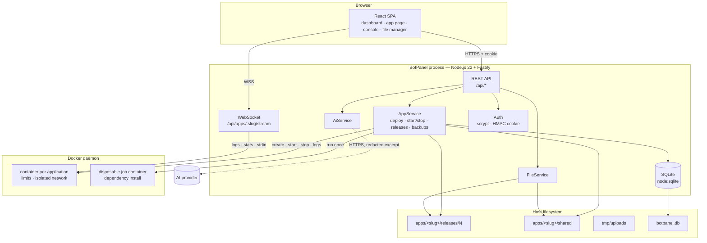

# Architecture

BotPanel is a single Node.js process that owns a SQLite database and talks to the Docker daemon. The
frontend is a static React build served by that same process.

## Backend

- **Fastify** with `@fastify/cookie`, `@fastify/multipart`, `@fastify/websocket` and
  `@fastify/static`.
- **TypeScript**, ES modules, `node:sqlite` for the database (no native module to compile),
  `dockerode` for the Docker API.
- Every route lives under `/api` and requires a session cookie, except `/api/health` and
  `/api/auth/*`.
- Errors are mapped to JSON `{ error, details }` with real HTTP status codes (400 validation,
  401 session, 404 not found, 409 conflict, 503 Docker unavailable).

### Main modules

| Module | Responsibility |
|---|---|
| `src/index.ts` | Boot: load config, build the server, reconcile orphan containers, start applications marked "start with the system", listen |
| `src/server.ts` | Fastify instance, security hooks, static frontend, WebSocket registration |
| `src/config.ts` | Environment → `PanelConfig` (including the instance id derived from the data directory) |
| `src/db.ts` | Schema, idempotent migrations (`ALTER TABLE` for new columns), all queries |
| `src/auth.ts` | Password verification (plain or scrypt), HMAC session tokens, login throttling, session epoch |
| `src/apps/` | Domain logic: `detect.ts` (runtime), `spec.ts` (container spec + restart policy), `service.ts` (create/update/deploy/start/stop/releases), `files.ts`, `backups.ts`, `uploads.ts`, `status.ts` (stop intent) |
| `src/docker/` | `service.ts` (client wrapper with retry and transient-error detection), `parse.ts` (stats, timestamps, state mapping), `templates.ts` (image presets and command rendering) |
| `src/ws/stream.ts` | Per-application channel: replays the current run's logs, streams metrics, forwards stdin |
| `src/ai/` | `providers.ts` (8 providers, three API shapes), `prompt.ts` (prompt + secret redaction), `service.ts` (settings, model listing, analyses) |
| `src/util/` | Archive extraction (zip-slip safe), filesystem helpers, slug, mutex, formatting |

## Frontend

- **React 19 + Vite + Tailwind v4**, no component library — the UI is built from a small set of local
  primitives (`components/ui.tsx`).
- Routing with React Router. Pages: Dashboard, Applications, New application, Application detail
  (tabs: Overview, Console, Logs, Files, Configuration, Releases, Backups), Backups, System,
  Settings, Login.
- `api.ts` is the single place that issues HTTP requests (typed, with a shared `401` handler that
  redirects to the login screen).
- `hooks.ts` holds `useAsync` (loading/error/polling that pauses when the tab is hidden),
  `useAppStream` (WebSocket with exponential backoff and run-aware log reset) and `useDeployment`
  (polls a deployment only while it runs).
- A route-level **error boundary** turns a render failure into a readable message instead of a blank
  page, and the sidebar keeps working.

## Data model (SQLite)

| Table | Content |
|---|---|
| `apps` | one row per application: runtime, image, commands, limits, env (JSON), ports (JSON), automation switches, active release, stop intent, icon |
| `releases` | immutable releases: sequence, directory, image, entry, commands, size, notes |
| `deployments` | deployment log and status (`running`/`success`/`failed`) |
| `events` | activity feed (created, started, stopped, released, backup, AI analysis…) |
| `settings` | key/value settings, including the AI configuration |
| `backups` | backup files (name, path, size, status, whether `/data` was included) |
| `ai_analyses` | AI analyses per application (provider, model, excerpt, result, error) |

Migrations are additive and idempotent: new columns are added with `ALTER TABLE ... ADD COLUMN` when
missing, so upgrading the panel never requires manual database work.

## Deploy pipeline

1. **Upload** — the ZIP goes to `tmp/uploads`, is size-checked, and the archive is inspected for
   entries (zip-slip protection: absolute paths and `..` are rejected).
2. **Detection** — runtime, entry file, dependency file and commands are inferred from the archive
   (`package.json`, `requirements.txt`, common entry names) and shown to the user before creation.
3. **Release** — a new `releases/N` directory is created and the archive extracted into it. A single
   wrapper folder is stripped when the ZIP has one.
4. **Dependencies** — a disposable container runs inside the release (`node:22-slim` +
   `npm install`/`npm ci`, `python:3.12-slim` + `pip install --requirement requirements.txt` into a
   release-local directory). The job container has the same resource limits and is removed
   afterwards, leaving no job containers behind.
5. **Switch** — the active release is updated and the application container is **recreated** with
   the same configuration but bound to the new release path. `/data` is untouched.
6. **Recovery** — if dependency installation fails, the new release is discarded and the previous
   one keeps running. The failure is recorded in the deployment log and in the events feed.
7. **Retention** — releases beyond `BOTPANEL_KEEP_RELEASES` are pruned, oldest first, never the
   active one.

## Isolation model

For each application:

- its own container, named `botpanel-<slug>`;
- its own Docker network, `botpanel-net-<slug>` (no container shares another application's network);
- `CapDrop: ["ALL"]`, `SecurityOpt: ["no-new-privileges"]`;
- memory limit **and** memory swap set to the same value (no swap for the application);
- CPU quota via `NanoCpus` and a PID limit;
- runs as `BOTPANEL_RUN_UID`/`_GID` (1000 by default), never as root;
- `RestartPolicy` derived from the two automation switches (see below);
- `json-file` logs capped at 5 MB × 3 files;
- host mounts limited to the release directory (`/app`) and the persistent directory (`/data`).

Every container and network carries `botpanel.instance` and `botpanel.app` labels. That is what makes
reconciliation safe: a panel instance only ever removes resources it created, so two panels pointing
at the same Docker daemon do not fight.

## Automation switches → Docker restart policy

| Start with the system | Restart automatically | Docker policy | Behaviour |
|---|---|---|---|
| on | on | `unless-stopped` | Comes back after a crash **and** after a VPS/daemon restart |
| off | on | `on-failure` | Comes back after a crash, but not with the VPS |
| on | off | `no` | The panel starts it when the panel starts; it does not survive a crash |
| off | off | `no` | Only starts when you press **Start** |

At boot the panel starts the applications marked "start with the system" (skipping the ones you
stopped deliberately) and realigns the restart policy of containers that already existed.

## Real time

`/api/apps/:slug/stream` is a WebSocket that:

- replays the **current run** of the container (each line carries the container's `StartedAt`, so a
  restart clears the screen instead of mixing executions),
- streams `stats` (status, CPU %, memory, PIDs, uptime) on an interval,
- accepts `stdin` for the console and `refresh` to force a metrics update,
- reports `unknown` when the Docker daemon is unreachable — never a fake `stopped`.

The client reconnects with exponential backoff (1 s → 10 s) and treats a closed socket as a
connection problem, not as a stopped application.

## i18n

The web interface and the code comments are currently in **Brazilian Portuguese**; the panel ships a
single locale. Documentation in this repository is in English. Adding another locale means
extracting the strings from `web/src/**` — there is no i18n layer yet.

## Known trade-offs

- The panel runs as **root** (Docker socket + chown of application files).
- SQLite is not encrypted at rest; the database holds application metadata and AI keys.
- The frontend talks to the same origin as the API; there is no separate CORS story.
- Applications are assumed to be trusted code you wrote: the isolation protects applications from
  each other, not the host from a malicious image you deliberately choose.
